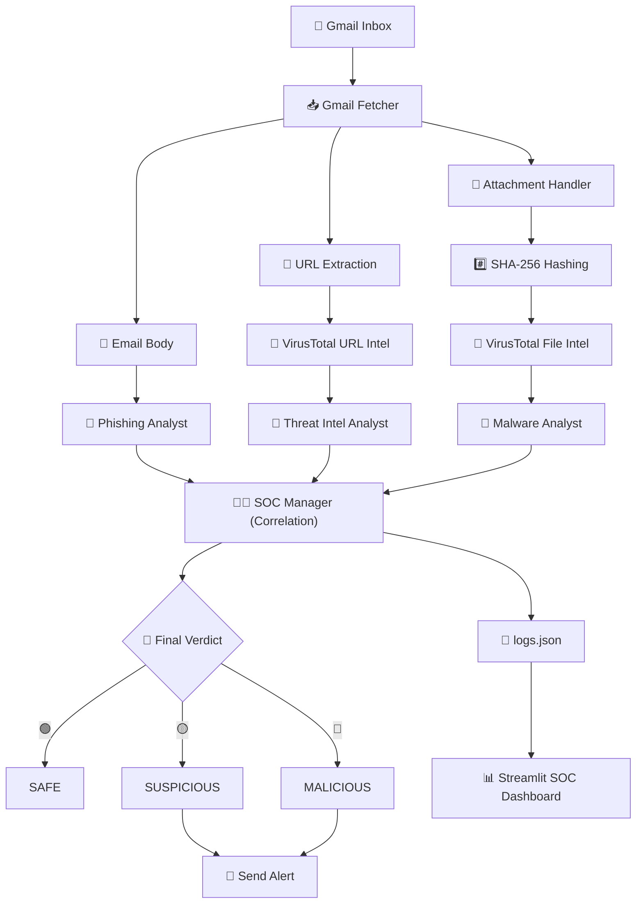

<div align="center">

# 🛡️ AI Email Security & Phishing Analysis Agent

**🤖 AI-powered email threat detection • 🧠 Multi-agent SOC analysis • 🔎 Threat intelligence • 🚨 Automated alerting**

[](https://www.python.org/)
[](https://crewai.com/)
[](https://deepmind.google/technologies/gemini/)
[](https://streamlit.io/)
[](https://www.virustotal.com/)

An intelligent email-security prototype that continuously monitors Gmail, analyzes suspicious emails and attachments, enriches indicators with VirusTotal, and uses a CrewAI multi-agent system powered by Google Gemini to generate an explainable **SAFE / SUSPICIOUS / MALICIOUS** verdict.

<br>

</div>

## 🚀 What Is This?

**AI Email Security & Phishing Analysis Agent** is an AI-assisted SOC automation project designed to investigate potentially malicious emails with minimal manual intervention. Instead of relying on a single detection mechanism, the system combines:

*   📧 **Email analysis**
*   🔗 **URL extraction**
*   📎 **Attachment analysis**
*   #️⃣ **SHA-256 file hashing**
*   🦠 **VirusTotal threat intelligence**
*   🤖 **CrewAI multi-agent reasoning**
*   🧠 **Google Gemini LLM**
*   👨‍💻 **SOC Manager correlation**
*   🚨 **Automated security alerts**
*   📊 **Streamlit SOC dashboard**

The result is an end-to-end prototype for AI-powered phishing triage and email threat investigation.

---

## 🧠 Core Capabilities

| Capability | Description |
| :--- | :--- |
| **📧 Gmail Monitoring** | Continuously monitors unread emails using IMAP. |
| **🎣 Phishing Detection** | AI-assisted analysis of email content and social-engineering indicators. |
| **🔗 URL Intelligence** | Extracts URLs and checks them against VirusTotal. |
| **📎 Attachment Analysis** | Extracts attachments and calculates SHA-256 hashes locally. |
| **🦠 Malware Reputation** | Looks up attachment hashes through VirusTotal. |
| **🤖 Multi-Agent AI** | Uses specialized CrewAI agents for different investigation tasks. |
| **🧠 Gemini LLM** | Provides natural-language security reasoning. |
| **👨‍💻 SOC Correlation** | Combines multiple analysis streams into a final verdict. |
| **🚨 Automated Alerting** | Sends SMTP email alerts for suspicious/malicious results. |
| **📊 SOC Dashboard** | Provides a Streamlit interface for investigation history. |
| **📝 Audit Logging** | Stores analysis results locally in `logs.json`. |

---

## 🤖 Multi-Agent SOC Architecture

The project follows a specialized-agent architecture rather than asking one AI agent to perform the entire investigation.

### 🎣 1. Email Phishing Analyst
Analyzes the raw email text for indicators such as:
> *Social engineering • Urgency • Suspicious requests • Credential harvesting • Impersonation • Phishing intent • Suspicious wording • Malicious attachment references*

### 🔎 2. Threat Intelligence Analyst
Receives URL intelligence from VirusTotal and evaluates:
> *Malicious detections • Suspicious reputation • Threat indicators • URL-analysis statistics*

### 🦠 3. Malware Analyst
Analyzes attachment reputation using a hash-based lookup approach to maintain privacy (files are not uploaded):
> `Attachment` ➔ `SHA-256 Hash` ➔ `VirusTotal Lookup` ➔ `Malware Reputation`

### 👨‍💻 4. SOC Manager
Acts as the final correlation layer. It synthesizes insights from the Phishing, Threat Intel, and Malware analysts to produce a final, explainable classification:
*   🟢 **SAFE**
*   🟡 **SUSPICIOUS**
*   🔴 **MALICIOUS**

---

## 🏗️ System Architecture


---

### 🛠️ Technology Stack

| Layer | Technology |
|-------|------------|
| 🐍 Language | Python 3.10+|
| 🤖 Agent Framework | CrewAI |
| 🧠 LLM | Google Gemini (google-generativeai) |
| 📧 Email | Gmail IMAP |
| 🔎 Threat Intelligence | VirusTotal API |
| 📊 Dashboard | Streamlit |
| 🚨 Alerting | SMTP |
| 🔐 Hashing | SHA-256 (hashlib) |

---

### 📁 Project Structure

```text

Email_analysis_AI_Agent/
├── 🤖 agents.py              # CrewAI agent definitions
├── 🚨 alert.py               # SMTP alerting
├── 📎 attachment_handler.py  # Attachment extraction + SHA-256 hashing
├── 📊 dashboard.py           # Streamlit SOC dashboard
├── 🔗 email_utils.py         # URL extraction utilities
├── 📧 gmail_fetcher.py       # Gmail IMAP collection
├── 🧠 llm_wrapper.py         # Google Gemini integration
├── 🎯 main_agent.py          # Main AI analysis orchestration
├── ▶️ run.py                 # Continuous monitoring loop
├── 📋 tasks.py               # CrewAI task definitions
├── 🔎 threat_intel.py        # VirusTotal integration
├── 🧪 vt_test.py             # VirusTotal testing utility
├── 📎 attachments/           # Locally extracted attachments
├── 📝 logs.json              # Analysis history
├── 🔐 .env                   # Local secrets/configuration
└── 📖 README.md

```
---


### ⚡ Quick Start

## 1️⃣ Clone the Repository
```code
git clone https://github.com/PrathamBhanushali30/Email_analysis_AI_Agent.git
cd Email_analysis_AI_Agent
```

## 2️⃣ Create a Virtual Environment
windows:
```code
python -m venv .venv
.venv\Scripts\activate
```
Linux/macOS: 
```code
python3 -m venv .venv
source .venv/bin/activate
```

## 3️⃣ Install Dependencies
```code
pip install crewai langchain-google-genai google-generativeai python-dotenv requests streamlit
```

## 4️⃣ Configuration

Create a .env file in the project root:
```code
GOOGLE_API_KEY=<your-google-gemini-api-key>
VT_API_KEY=<your-virustotal-api-key>

EMAIL_USER=<your-gmail-address>
EMAIL_PASS=<your-gmail-app-password>
ALERT_EMAIL=<security-alert-recipient>
```

> *⚠️ SECURITY WARNING: NEVER commit your .env file. Add .env to your .gitignore. If credentials were previously committed or shared publicly, rotate them immediately.*

---

### ▶️ Running the Agent

Start the continuous email-monitoring system:
```code
python run.py
```

The agent runs continuously (checking every ~60 seconds):
> `Checks Gmail` ➔ `Finds unread messages` ➔ `Analyzes email` ➔ `Scans URLs` ➔ `Hashes attachments` ➔ `Queries VirusTotal` ➔ `Runs CrewAI agents` ➔ `Generates SOC verdict` ➔ `Saves result` ➔ `Sends alert if required`

---


### 📊 Launch the SOC Dashboard

In a new terminal window, run:
```code
streamlit run dashboard.py
```
> This launches a web UI displaying analyzed emails, URL/File intelligence, AI analysis, and final SOC verdicts loaded from `logs.json`.

---


### 🗺️ Roadmap


[x] Phase 1 — Core Engine: Gmail monitoring, URL/Attachment extraction, VirusTotal integration, CrewAI agents, Gemini LLM, Streamlit dashboard.

[ ] Phase 2 — Advanced Email Security: HTML email parsing, SPF/DKIM/DMARC validation, Sender/Domain reputation, BEC detection.

[ ] Phase 3 — Advanced Threat Intelligence: Hybrid Analysis, YARA, URLhaus, AbuseIPDB, IOC enrichment.

[ ] Phase 4 — Malware Analysis: Static file analysis, Entropy analysis, Macro detection, Sandbox integration.

[ ] Phase 5 — AI Security: Structured LLM outputs, Prompt-injection detection, Explainable evidence scoring.

[ ] Phase 6 — Full SOC Platform: PostgreSQL storage, RBAC, SIEM integration, MITRE ATT&CK mapping.

---


### 🔒 Production Security Considerations

This repository is currently a prototype/research implementation. Before production deployment, consider implementing:

🔑 OAuth2: Secure Gmail authentication instead of App Passwords.

📦 Sandboxing: Antivirus scanning and URL sandboxing.

🛡️ Rate Limiting & Size Limits: Restrict attachment sizes and normalize filenames safely.

🗄️ Database Logging: Replace logs.json with a structured database (e.g., PostgreSQL).

🧠 Prompt Defenses: Add robust prompt-injection defenses and enforce structured LLM output schemas.

> * Note: The AI verdict should be treated as an analyst assistance tool, not an unquestionable security decision. *

---


### 👨‍💻 Author

*M.Tech — Artificial Intelligence & Data Science*

*Specialization: Cybersecurity*

Areas of Interest:
> `Cybersecurity` • `SOC Automation` • `AI/ML Security` • `Threat Intelligence` • `Phishing Detection` • `Malware Analysis`


## 🛡️ Built for Cybersecurity Research & AI-Powered SOC Automation

*Detect • Investigate • Correlate • Respond*

